#  Enterprise CI/CD Blueprint: NestJS Backend
**Project:** Liceum Backend  
**Stack:** NestJS • Node.js 20 • pnpm 10 • PM2 • AWS OIDC • S3 • GitHub Self-Hosted Runners

---

## 1. Architecture Diagram (Automated Flow)
This diagram represents the **Secure Unidirectional Flow**. Credentials are never stored; they are generated dynamically via OIDC.

```mermaid
graph LR
    %% -- Global Styling Definitions --
    classDef github fill:#24292e,stroke:#24292e,color:#ffffff,stroke-width:2px;
    classDef security fill:#ffffff,stroke:#E05243,stroke-width:2px,color:#E05243,font-weight:bold;
    classDef compute fill:#ffffff,stroke:#0073BB,stroke-width:2px,color:#0073BB;
    classDef storage fill:#ffffff,stroke:#3B48CC,stroke-width:2px,color:#3B48CC;
    classDef local fill:#f8fafc,stroke:#475569,stroke-width:2px,color:#1e293b,stroke-dasharray: 5 5;

    %% -- Section: Local Developer Environment --
    subgraph Local_Environment [Local Development]
        direction TB
        Dev((Developer))
        Task[Taskfile / Act]:::local
    end

    %% -- Section: GitHub Control Plane --
    subgraph GitHub_Cloud [GitHub Orchestration]
        direction TB
        GH[GitHub Repo]:::github
        GA{Actions Engine}:::github
        Filter[Path Filter]:::github
    end

    %% -- Section: AWS Security Layer --
    subgraph AWS_Security [Identity & Access]
        direction TB
        OIDC[OIDC Federation]:::security
        IAM[IAM Execution Role]:::security
    end

    %% -- Section: Build & Production (EC2) --
    subgraph AWS_Infrastructure [AWS Cloud Infrastructure]
        direction TB
        
        subgraph Build_Plane [Build Environment]
            Runner[Self-Hosted Runner]:::compute
            NestBuild[NestJS Build]:::compute
        end

        subgraph Storage_Plane [Artifact Registry]
            S3[(S3 Artifact Bucket)]:::storage
        end

        subgraph Deploy_Plane [Production Server]
            Extract[Extract & Rsync]:::compute
            PM2[PM2: main.js]:::compute
        end
    end

    %% -- Logical Flow Connections --
    Dev -->|1. Local Simulation| Task
    Task -->|2. Git Push| GH
    GH -->|3. Webhook| GA
    GA -->|4. Path Analysis| Filter
    
    GA <-->|5. JWT Exchange| OIDC
    OIDC -->|6. STS AssumeRole| IAM
    IAM -.->|7. Temporary Token| GA
    
    GA -->|8. Dispatch Job| Runner
    Runner -->|9. Compile Source| NestBuild
    NestBuild -->|10. Versioned Upload| S3
    S3 -->|11. Atomic Pull| Extract
    Extract -->|12. Zero-Downtime Reload| PM2

    %% -- Link Styling (Visual Polish) --
    linkStyle 4,5,6 stroke:#E05243,stroke-width:2px;
    linkStyle 9,10 stroke:#3B48CC,stroke-width:2px;
    linkStyle 11 stroke:#0073BB,stroke-width:2px;
```



---

## 2. Understanding the CI/CD Components

### 2.1 Workflow Trigger Mechanism

The CI/CD pipeline is triggered by two events, configured in [ci-cd-backend.yaml](file:///c:/Users/OWDEVLP010/liceum/bcm-backend/.github/workflows/ci-cd-backend.yaml):

#### Event 1: Pull Request Merge to Main
```yaml
on:
  pull_request:
    branches: [main]           # Only PRs targeting main branch
    types: [closed]            # Triggers when PR is closed (merged or just closed)
```

**How it works:**
- When a PR targeting the `main` branch is closed, the workflow starts
- The `filter` job checks if the PR was actually **merged** (not just closed): `github.event.pull_request.merged == true`
- If merged AND backend files changed, the `ci-cd` job executes

#### Event 2: Manual Trigger (workflow_dispatch)
```yaml
  workflow_dispatch:
    inputs:
      debug_enabled:
        description: 'Run with debug logging'
        type: boolean
        default: false
```

**How it works:**
- Navigate to **Actions** tab → Select **CI/CD - Backend (Production)** → Click **Run workflow**
- Bypasses the path filter (always runs)
- Useful for emergency deployments or testing

---

### 2.2 Path Filtering System (Smart Build Optimization)

The [file-filter.yml](file:///c:/Users/OWDEVLP010/liceum/bcm-backend/.github/utils/file-filter.yml) defines which file changes should trigger a build:

```yaml
backend:
  - "src/**"              # NestJS source code
  - "components/**"       # Shared components
  - "package.json"        # Dependencies
  - "pnpm-lock.yaml"      # Lock file
  - "tsconfig.json"       # TypeScript config
  - "nest-cli.json"       # NestJS CLI configuration
  - ".env*"               # Environment variables
```

**How the filter works:**
1. The `filter` job uses [dorny/paths-filter](https://github.com/dorny/paths-filter) action
2. It compares changed files against the patterns in `file-filter.yml`
3. Sets output variable `backend: 'true'` if any backend file changed
4. The `ci-cd` job only runs if `needs.filter.outputs.backend == 'true'`

**Why this matters:**
- Changing only `README.md` won't trigger a build
- Changing `src/app.module.ts` will trigger a build
- Prevents unnecessary deployments

---

### 2.3 Reusable Workflow Architecture

The actual build/deploy logic lives in a **public central repository** as a reusable workflow. This promotes:
- **Code reusability** across multiple projects
- **Centralized maintenance** (fix once, apply everywhere)
- **Version control** of CI/CD logic

**Caller Workflow** ([ci-cd-backend.yaml](file:///c:/Users/OWDEVLP010/liceum/bcm-backend/.github/workflows/ci-cd-backend.yaml)):
```yaml
uses: LoganathanChandrasekar/Objectways-Github-Actions/.github/workflows/nestjs-ci.yml@main
with:
  node-version: '20'
  pnpm-version: '10'
  s3-bucket: ${{ vars.S3_BUCKET_NAME }}
  # ... other inputs
secrets:
  aws-role-arn: ${{ secrets.AWS_ROLE_ARN }}
```

**Reusable Workflow Source**: [Objectways-Github-Actions](https://github.com/LoganathanChandrasekar/Objectways-Github-Actions)

**Input Parameters Explained:**

| Input | Type | Purpose | Example |
|:------|:-----|:--------|:--------|
| `node-version` | string | Node.js version to install | `'20'` |
| `pnpm-version` | string | pnpm package manager version | `'10'` |
| `working-directory` | string | Root directory of the project | `'.'` |
| `aws-region` | string | AWS region for S3 and OIDC | `'us-east-1'` |
| `deploy-runner` | string | GitHub runner label | `'self-hosted'` |
| `s3-bucket` | string | S3 bucket for build artifacts | `'my-builds-bucket'` |
| `pm2-name` | string | PM2 process name | `'liceum-backend'` |
| `deploy-path` | string | Deployment directory on EC2 | `'/home/ubuntu/bcm-backend'` |
| `env-source-path` | string | Path to .env file on runner | `'/home/ubuntu/apps/bcm-backend/.env'` |

---

### 2.4 AWS OIDC Security Setup (Zero Credentials Storage)

OIDC (OpenID Connect) allows GitHub Actions to authenticate with AWS **without storing long-lived credentials**.

#### Step 1: Create IAM OIDC Identity Provider
*   **URL**: `https://token.actions.githubusercontent.com`
*   **Audience**: `sts.amazonaws.com`

#### Step 2: Create IAM Role with Trust Policy
```json
{
  "Version": "2012-10-17",
  "Statement": [
    {
      "Effect": "Allow",
      "Principal": {
        "Federated": "arn:aws:iam::YOUR_ACCOUNT_ID:oidc-provider/token.actions.githubusercontent.com"
      },
      "Action": "sts:AssumeRoleWithWebIdentity",
      "Condition": {
        "StringEquals": {
          "token.actions.githubusercontent.com:aud": "sts.amazonaws.com"
        },
        "StringLike": {
          "token.actions.githubusercontent.com:sub": "repo:YOUR_ORG/YOUR_REPO:*"
        }
      }
    }
  ]
}
```

#### Step 3: Attach Permissions Policy
```json
{
  "Version": "2012-10-17",
  "Statement": [
    {
      "Sid": "S3ArtifactAccess",
      "Effect": "Allow",
      "Action": ["s3:PutObject", "s3:GetObject", "s3:ListBucket"],
      "Resource": ["arn:aws:s3:::YOUR_BUCKET_NAME", "arn:aws:s3:::YOUR_BUCKET_NAME/*"]
    },
    {
      "Sid": "EC2DeploymentAccess",
      "Effect": "Allow",
      "Action": ["ec2:DescribeInstances"],
      "Resource": "*",
      "Condition": {
        "StringEquals": { "ec2:ResourceTag/Name": "liceum-prod" }
      }
    }
  ]
}
```

---

### 2.5 GitHub Repository Configuration

**Secrets:**
| Secret | Purpose |
|:-------|:--------|
| `AWS_ROLE_ARN` | IAM role ARN for OIDC authentication |

**Variables:**
| Variable | Value Example |
|:---------|:--------------|
| `S3_BUCKET_NAME` | `liceum-builds` |
| `PM2_APP_NAME` | `liceum-backend` |
| `DEPLOYMENT_PATH` | `/home/ubuntu/bcm-backend` |
| `ENV_FILE_SOURCE` | `/home/ubuntu/apps/bcm-backend/.env` |

---

### 2.6 Deployment Flow Explained (Step-by-Step)

#### Build Job (`build-test`)
1. **Checkout & Setup**: Installs Node.js 20, pnpm 10.
2. **Restore Cache**: Restores `dist/` and `pnpm-store` (speeds up subsequent builds).
3. **Environment**: Copies `.env` from secure location (`ENV_FILE_SOURCE`) if valid.
4. **Dependencies**: `pnpm install --prefer-offline`.
5. **Prisma**: `pnpm prisma:generate`.
6. **Lint & Audit**: Parallel execution of linting and security audit.
7. **Build**: `pnpm build` (Outputs to `dist/`).
8. **Artifact**: Tars `dist/`, `node_modules/`, and `package.json`.
9. **S3 Upload**: Offloads artifact to S3 bucket.

#### Deploy Job (`deploy`)
1. **Download**: Pulls artifact from S3.
2. **Extract**: Unpacks to temporary directory.
3. **Sync**: `rsync -a --delete` to final `DEPLOYMENT_PATH` (Atomic update).
4. **Restart**: `pm2 restart liceum-backend` (Zero downtime reload if cluster mode, or fast restart).
5. **Persistence**: `pm2 save`.

---

## 3. Server Setup (One-Time Preparation)

Prepare the EC2 instance (Ubuntu 22.04 recommended):

```bash
# 1. Install Node.js 20 & pnpm
curl -fsSL https://deb.nodesource.com/setup_20.x | sudo -E bash -
sudo apt-get install -y nodejs
sudo npm install -g pnpm@10 pm2

# 2. Install AWS CLI v2
curl "https://awscli.amazonaws.com/awscli-exe-linux-x86_64.zip" -o "awscliv2.zip"
sudo apt install unzip -y && unzip awscliv2.zip && sudo ./aws/install

# 3. Create Deployment Directory
sudo mkdir -p /home/ubuntu/bcm-backend
sudo chown -R ubuntu:ubuntu /home/ubuntu/bcm-backend

# 4. Setup Secret Env File
mkdir -p /home/ubuntu/apps/bcm-backend
nano /home/ubuntu/apps/bcm-backend/.env
# Paste your production env variables here
```

---

## 4. Local CI/CD Simulation

Test your pipeline locally before pushing using `act` and `task`.

### 4.1 Prerequisites
- **Task**: [Installation Guide](https://taskfile.dev/installation/)
- **Act**: `choco install act-cli` (Windows) or `brew install act` (Mac)
- **Docker**: Must be running.

### 4.2 Setup Local Secrets
Create a `.secrets` file in the project root:
```bash
AWS_ROLE_ARN=arn:aws:iam::123456789012:role/LocalTest
```
*Measurements should be mocked or ignored locally.*

### 4.3 Run the Test
```bash
task test-ci
```
**Command Under the Hood:**
```bash
act workflow_dispatch \
  --container-architecture linux/amd64 \
  -W .github/workflows/ci-cd-backend.yaml \
  --secret-file .secrets \
  --env-file .env.example
```

**What to Expect:**
- Docker pulls a 20GB+ image (first time only)
- Steps run in container
- OIDC and S3 steps are SKIPPED (due to `if: !env.ACT`)
- Build and Lint pass successfully

---

## 5. Path to Perfection (The Road to 10/10)

Your current setup is a solid **9.5/10**. To achieve a perfect **10/10 Enterprise Standard**, consider implementing the following:

### 5.1 Deployment Verification (Smoke Test)
**Why:** Currently, PM2 restarts the app, but we don't know if it's actually *serving traffic*.
**Fix:** Add a health check step immediately after deployment.
```bash
# In your reusable workflow (deploy job):
curl --fail --retry 3 --retry-delay 5 http://localhost:3000/api/health
```

### 5.2 Automated Notifications
**Why:** You need to check GitHub for status. Push notifications are faster.
**Fix:** Add a Slack/Discord notification step on failure/success.
```yaml
- uses: 8398a7/action-slack@v3
  with:
    status: ${{ job.status }}
    fields: repo,message,commit,author,action,eventName,ref,workflow,job,took
  env:
    SLACK_WEBHOOK_URL: ${{ secrets.SLACK_WEBHOOK_URL }}
```

### 5.3 Semantic Versioning
**Why:** Automated release notes and version tagging (`v1.0.1`, `v1.1.0`) add professional polish.
**Fix:** Integrate `semantic-release` to analyze commits and update `package.json` version automatically.

---

## 6. Troubleshooting Guide

| Issue | Cause | Fix |
|:------|:------|:----|
| **"pnpm: command not found"** | Not in PATH | Ensure `pnpm/action-setup` runs before use. |
| **"AWS Role Assumption Failed"** | Trust policy mismatch | Check GitHub repo name in AWS IAM Trust Policy. |
| **"EACCES: permission denied"** | Directory ownership | Run `sudo chown -R ubuntu:ubuntu /path/to/app`. |
| **"Prisma Client not initialized"** | skipped generation | Ensure `pnpm prisma:generate` runs in build. |