#  Enterprise CI/CD Blueprint: Next.js Standalone
**Project:** Liceum Frontend  
**Stack:** Next.js 20 (Standalone) • pnpm 10 • PM2 • AWS OIDC • S3 • GitHub Self-Hosted Runners

---

## 1. Architecture Diagram (Automated Flow)
This diagram represents the **Secure Unidirectional Flow**. Credentials are never stored; they are generated dynamically via OIDC.

```mermaid
graph LR
    %% -- Global Styling Definitions --
    classDef github fill:#24292e,stroke:#24292e,color:#ffffff,stroke-width:2px;
    classDef security fill:#ffffff,stroke:#E05243,stroke-width:2px,color:#E05243,font-weight:bold;
    classDef compute fill:#ffffff,stroke:#0073BB,stroke-width:2px,color:#0073BB;
    classDef storage fill:#ffffff,stroke:#3B48CC,stroke-width:2px,color:#3B48CC;
    classDef local fill:#f8fafc,stroke:#475569,stroke-width:2px,color:#1e293b,stroke-dasharray: 5 5;

    %% -- Section: Local Developer Environment --
    subgraph Local_Environment [Local Development]
        direction TB
        Dev((Developer))
        Task[Taskfile / Act]:::local
    end

    %% -- Section: GitHub Control Plane --
    subgraph GitHub_Cloud [GitHub Orchestration]
        direction TB
        GH[GitHub Repo]:::github
        GA{Actions Engine}:::github
        Filter[Path Filter]:::github
    end

    %% -- Section: AWS Security Layer --
    subgraph AWS_Security [Identity & Access]
        direction TB
        OIDC[OIDC Federation]:::security
        IAM[IAM Execution Role]:::security
    end

    %% -- Section: Build & Production (EC2) --
    subgraph AWS_Infrastructure [AWS Cloud Infrastructure]
        direction TB
        
        subgraph Build_Plane [Build Environment]
            Runner[Self-Hosted Runner]:::compute
            NextBuild[Next.js Standalone Build]:::compute
        end

        subgraph Storage_Plane [Artifact Registry]
            S3[(S3 Artifact Bucket)]:::storage
        end

        subgraph Deploy_Plane [Production Server]
            Extract[Extract & Rsync]:::compute
            PM2[PM2: server.js]:::compute
        end
    end

    %% -- Logical Flow Connections --
    Dev -->|1. Local Simulation| Task
    Task -->|2. Git Push| GH
    GH -->|3. Webhook| GA
    GA -->|4. Path Analysis| Filter
    
    GA <-->|5. JWT Exchange| OIDC
    OIDC -->|6. STS AssumeRole| IAM
    IAM -.->|7. Temporary Token| GA
    
    GA -->|8. Dispatch Job| Runner
    Runner -->|9. Compile Standalone| NextBuild
    NextBuild -->|10. Versioned Upload| S3
    S3 -->|11. Atomic Pull| Extract
    Extract -->|12. Zero-Downtime Reload| PM2

    %% -- Link Styling (Visual Polish) --
    linkStyle 4,5,6 stroke:#E05243,stroke-width:2px;
    linkStyle 9,10 stroke:#3B48CC,stroke-width:2px;
    linkStyle 11 stroke:#0073BB,stroke-width:2px;
```



---

## 2. Understanding the CI/CD Components

### 2.1 Workflow Trigger Mechanism

The CI/CD pipeline is triggered by two events, configured in [ci-cd-frontend.yaml](file:///c:/Users/OWDEVLP010/liceum/bcm-frontend/.github/workflows/ci-cd-frontend.yaml):

#### Event 1: Pull Request Merge to Staging
```yaml
on:
  pull_request:
    branches: [staging]        # Only PRs targeting staging branch
    types: [closed]            # Triggers when PR is closed (merged or just closed)
```

**How it works:**
- When a PR targeting the `staging` branch is closed, the workflow starts
- The `filter` job checks if the PR was actually **merged** (not just closed): `github.event.pull_request.merged == true`
- If merged AND frontend files changed, the `ci-cd` job executes

#### Event 2: Manual Trigger (workflow_dispatch)
```yaml
  workflow_dispatch:
    inputs:
      debug_enabled:
        description: 'Run with debug logging'
        type: boolean
        default: false
```

**How it works:**
- Navigate to **Actions** tab → Select **CI/CD - Frontend (Production)** → Click **Run workflow**
- Bypasses the path filter (always runs)
- Useful for emergency deployments or testing

---

### 2.2 Path Filtering System (Smart Build Optimization)

The [file-filter.yml](file://liceum/bcm-frontend/.github/utils/file-filter.yml) defines which file changes should trigger a build:

```yaml
frontend:
  - "app/**"              # Next.js app directory (routes, layouts)
  - "components/**"       # React components
  - "lib/**"              # Utility libraries
  - "hooks/**"            # Custom React hooks
  - "styles/**"           # CSS/styling files
  - "config/**"           # Configuration files
  - "public/**"           # Static assets
  - "package.json"        # Dependencies
  - "pnpm-lock.yaml"      # Lock file (ensures exact versions)
  - "next.config.ts"      # Next.js configuration
  - "tailwind.config.ts"  # Tailwind CSS config
  - "tsconfig.json"       # TypeScript config
  - "postcss.config.js"   # PostCSS config
  - ".env*"               # Environment variables
```

**How the filter works:**
1. The `filter` job uses [dorny/paths-filter](https://github.com/dorny/paths-filter) action
2. It compares changed files against the patterns in `file-filter.yml`
3. Sets output variable `frontend: 'true'` if any frontend file changed
4. The `ci-cd` job only runs if `needs.filter.outputs.frontend == 'true'`

**Why this matters:**
- Changing only `README.md` won't trigger a build (saves time and resources)
- Changing `package.json` will trigger a build (dependency changes need testing)
- Prevents unnecessary EC2 CPU usage and deployment cycles

---

### 2.3 Reusable Workflow Architecture

The actual build/deploy logic lives in a **public repository** as a reusable workflow. This promotes:
- **Code reusability** across multiple projects
- **Centralized maintenance** (fix once, apply everywhere)
- **Version control** of CI/CD logic

#### How Reusable Workflows Work

**Caller Workflow** ([ci-cd-frontend.yaml](file://liceum/bcm-frontend/.github/workflows/ci-cd-frontend.yaml)):
```yaml
uses: LoganathanChandrasekar/Objectways-Github-Actions/.github/workflows/nextjs-ci.yml@main
with:
  node-version: '20'
  pnpm-version: '10'
  s3-bucket: ${{ vars.S3_BUCKET_NAME }}
  # ... other inputs
secrets:
  aws-role-arn: ${{ secrets.AWS_ROLE_ARN }}
```

**Reusable Workflow** ([public-repo-eg.yaml](file://liceum/bcm-frontend/.github/public-repo-eg.yaml)):
```yaml
on:
  workflow_call:
    inputs:
      node-version: { type: string, default: '20' }
      pnpm-version: { type: string, default: '9' }
      # ... other inputs
    secrets:
      aws-role-arn: { required: true }
```

**Input Parameters Explained:**

| Input | Type | Purpose | Example |
|:------|:-----|:--------|:--------|
| `node-version` | string | Node.js version to install | `'20'` |
| `pnpm-version` | string | pnpm package manager version | `'10'` |
| `working-directory` | string | Root directory of the project | `'.'` |
| `aws-region` | string | AWS region for S3 and OIDC | `'us-east-1'` |
| `deploy-runner` | string | GitHub runner label | `'self-hosted'` |
| `s3-bucket` | string | S3 bucket for build artifacts | `'my-builds-bucket'` |
| `pm2-name` | string | PM2 process name | `'liceum-frontend'` |
| `deploy-path` | string | Deployment directory on EC2 | `'/home/ubuntu/bcm-frontend'` |
| `env-source-path` | string | Path to .env file on runner | `'/home/ubuntu/apps/bcm-frontend/.env'` |

**Secret Parameters:**
- `aws-role-arn`: IAM role ARN for OIDC authentication (e.g., `arn:aws:iam::123456789012:role/GitHubActionsRole`)

---

### 2.4 AWS OIDC Security Setup (Zero Credentials Storage)

OIDC (OpenID Connect) allows GitHub Actions to authenticate with AWS **without storing long-lived credentials**.

#### Step 1: Create IAM OIDC Identity Provider

1. Go to **AWS IAM Console** → **Identity Providers** → **Add Provider**
2. Configure:
   - **Provider Type**: OpenID Connect
   - **Provider URL**: `https://token.actions.githubusercontent.com`
   - **Audience**: `sts.amazonaws.com`
3. Click **Add Provider**

#### Step 2: Create IAM Role with Trust Policy

1. Go to **IAM** → **Roles** → **Create Role**
2. Select **Custom Trust Policy** and paste:

```json
{
  "Version": "2012-10-17",
  "Statement": [
    {
      "Effect": "Allow",
      "Principal": {
        "Federated": "arn:aws:iam::YOUR_ACCOUNT_ID:oidc-provider/token.actions.githubusercontent.com"
      },
      "Action": "sts:AssumeRoleWithWebIdentity",
      "Condition": {
        "StringEquals": {
          "token.actions.githubusercontent.com:aud": "sts.amazonaws.com"
        },
        "StringLike": {
          "token.actions.githubusercontent.com:sub": "repo:YOUR_ORG/YOUR_REPO:*"
        }
      }
    }
  ]
}
```

**Replace:**
- `YOUR_ACCOUNT_ID`: Your AWS account ID (12 digits)
- `YOUR_ORG/YOUR_REPO`: Your GitHub organization/username and repository name

#### Step 3: Attach Permissions Policy

Create a custom policy with **least privilege** permissions:

```json
{
  "Version": "2012-10-17",
  "Statement": [
    {
      "Sid": "S3ArtifactAccess",
      "Effect": "Allow",
      "Action": [
        "s3:PutObject",
        "s3:GetObject",
        "s3:ListBucket"
      ],
      "Resource": [
        "arn:aws:s3:::YOUR_BUCKET_NAME",
        "arn:aws:s3:::YOUR_BUCKET_NAME/*"
      ]
    },
    {
      "Sid": "EC2DeploymentAccess",
      "Effect": "Allow",
      "Action": [
        "ec2:DescribeInstances"
      ],
      "Resource": "*",
      "Condition": {
        "StringEquals": {
          "ec2:ResourceTag/Name": "liceum-prod"
        }
      }
    }
  ]
}
```

**Security Principles:**
-  Only grants S3 access to specific bucket
-  Only allows EC2 describe for instances tagged `Name: liceum-prod`
-  No ability to create/delete resources
-  Credentials expire after 1 hour (AWS default)

#### Step 4: Copy Role ARN

After creating the role, copy the **Role ARN** (e.g., `arn:aws:iam::123456789012:role/GitHubActionsRole`). You'll need this for GitHub secrets.

---

### 2.5 GitHub Repository Configuration

#### Required Secrets (Settings → Secrets and variables → Actions → Secrets)

| Secret Name | Value | Purpose |
|:------------|:------|:--------|
| `AWS_ROLE_ARN` | `arn:aws:iam::123456789012:role/GitHubActionsRole` | IAM role for OIDC authentication |

#### Required Variables (Settings → Secrets and variables → Actions → Variables)

| Variable Name | Example Value | Purpose |
|:--------------|:--------------|:--------|
| `S3_BUCKET_NAME` | `liceum-builds` | S3 bucket for storing build artifacts |
| `PM2_APP_NAME` | `liceum-frontend` | PM2 process name for the application |
| `DEPLOYMENT_PATH` | `/home/ubuntu/bcm-frontend` | Target directory on EC2 |
| `ENV_FILE_SOURCE` | `/home/ubuntu/apps/bcm-frontend/.env` | Path to .env file on runner |

**Why use Variables instead of hardcoding?**
- Easy to update without modifying workflow files
- Can be different per environment (staging vs production)
- Centralized configuration management

---

### 2.6 Self-Hosted Runner Setup

#### Why Self-Hosted Runners?

| Aspect | GitHub-Hosted | Self-Hosted (EC2) |
|:-------|:--------------|:------------------|
| **Cost** | Free tier limited, then $0.008/min | EC2 costs only |
| **Performance** | 2-core, 7GB RAM | Customizable (e.g., m5.xlarge: 4-core, 16GB) |
| **Caching** | Ephemeral (lost after job) | Persistent (faster builds) |
| **Network** | Public internet | Same VPC as deployment target |
| **Deployment** | Requires SSH or AWS credentials | Direct filesystem access |

#### EC2 Instance Requirements

**Recommended Specs:**
- **Instance Type**: `t3.medium` (2 vCPU, 4GB RAM) or `m5.xlarge` (4 vCPU, 16GB RAM) for faster builds
- **Storage**: 30GB EBS volume (GP3)
- **OS**: Ubuntu 22.04 LTS
- **Security Group**: Allow outbound HTTPS (443) for GitHub API
- **IAM Instance Profile**: Not required (OIDC handles AWS auth)

#### Runner Installation

1. **Navigate to GitHub Repository** → **Settings** → **Actions** → **Runners** → **New self-hosted runner**
2. **Select OS**: Linux
3. **SSH into EC2** and run the provided commands:

```bash
# Download and extract runner
mkdir actions-runner && cd actions-runner
curl -o actions-runner-linux-x64-2.311.0.tar.gz -L https://github.com/actions/runner/releases/download/v2.311.0/actions-runner-linux-x64-2.311.0.tar.gz
tar xzf ./actions-runner-linux-x64-2.311.0.tar.gz

# Configure runner (use the token from GitHub UI)
./config.sh --url https://github.com/YOUR_ORG/YOUR_REPO --token YOUR_TOKEN

# Install as a service (runs on boot)
sudo ./svc.sh install
sudo ./svc.sh start
```

4. **Verify**: Check GitHub UI - runner should show as "Idle"

#### Runner Labels

By default, the runner gets the `self-hosted` label. The workflow uses:
```yaml
runs-on: ${{ inputs.deploy-runner }}  # 'self-hosted'
```

---

### 2.7 Deployment Flow Explained (Step-by-Step)

#### Build Job (`build-test`)

1. **Checkout Code**: Downloads repository to runner
2. **Setup pnpm**: Installs pnpm package manager
3. **Setup Node & Cache**: Installs Node.js and restores pnpm cache
4. **Restore Next.js Cache**: Restores `.next/cache` for incremental builds
5. **Copy .env File**: Copies environment variables from `env-source-path`
6. **Install Dependencies**: Runs `pnpm install --prefer-offline`
7. **Lint & Security**: Runs `pnpm audit` and `pnpm lint` in parallel
8. **Build Next.js**: Runs `pnpm build` (creates standalone output)
9. **Prepare Standalone**: Copies `public/` and `.next/static/` into `.next/standalone/`
10. **Create Tarball**: Compresses standalone directory to `build-{sha}.tar.gz`
11. **AWS Auth (OIDC)**: Exchanges GitHub JWT for temporary AWS credentials
12. **Upload to S3**: Uploads tarball to `s3://bucket/builds/build-{sha}.tar.gz`

#### Deploy Job (`deploy`)

1. **AWS Auth**: Re-authenticates with OIDC (jobs don't share credentials)
2. **Download from S3**: Downloads `build-{sha}.tar.gz` to `deploy-temp/`
3. **Extract Tarball**: Extracts files in `deploy-temp/`
4. **Rsync to Target**: Syncs files to `/home/ubuntu/bcm-frontend/` (atomic, deletes old files)
5. **Restart PM2**: Deletes old process and starts `server.js` with PM2
6. **Save PM2 Config**: Persists PM2 process list (survives reboots)
7. **Cleanup**: Removes `deploy-temp/`

**Key Design Decisions:**

- **Why S3 as intermediary?** 
  - Decouples build and deploy (can deploy old builds)
  - Provides artifact history for rollbacks
  - Enables multi-server deployments

- **Why `rsync --delete`?**
  - Ensures deployment directory matches build exactly
  - Removes old files that no longer exist in the build
  - Atomic operation (safer than `rm -rf && cp`)

- **Why restart PM2 instead of reload?**
  - `pm2 reload` requires cluster mode (not applicable for standalone)
  - `pm2 delete + start` ensures clean process state
  - Downtime is negligible (~1-2 seconds)

---

## 3. Server Setup (One-Time Preparation)

Before running the pipeline or a manual deploy, prepare the EC2 instance with these idempotent scripts.

### 2.1 Core Software Stack
```bash
# 1. Update System
sudo apt-get update -y

# 2. Check/Install Node.js 20
if ! command -v node &> /dev/null; then
    curl -fsSL https://deb.nodesource.com/setup_20.x | sudo -E bash -
    sudo apt-get install -y nodejs
fi

# 3. Check/Install pnpm & PM2
if ! command -v pnpm &> /dev/null; then sudo npm install -g pnpm@10; fi
if ! command -v pm2 &> /dev/null; then sudo npm install -g pm2; fi

# 4. Check/Install AWS CLI v2
if ! command -v aws &> /dev/null; then
    curl "https://awscli.amazonaws.com/awscli-exe-linux-x86_64.zip" -o "awscliv2.zip"
    sudo apt install unzip -y && unzip awscliv2.zip && sudo ./aws/install
fi
```

### 2.2 Directory & Permissions Setup
```bash
# Set up the deployment target with correct ownership
TARGET_DIR="/home/ubuntu/bcm-frontend"
sudo mkdir -p $TARGET_DIR
sudo chown -R ubuntu:ubuntu $TARGET_DIR
sudo chmod -R 755 $TARGET_DIR
```

---

## 3. Manual Deployment Protocol (No CI/CD Fallback)

Use this method if the CI/CD is down or for rapid environment testing. This replicates the CI/CD logic exactly.

### Step 1: Build Locally (On your PC)
```bash
# 1. Build the standalone bundle
pnpm build

# 2. Prepare the bundle (copy public/static into standalone)
mkdir -p .next/standalone/public .next/standalone/.next/static
cp -r public/* .next/standalone/public/
cp -r .next/static/* .next/standalone/.next/static/

# 3. Zip it up
cd .next/standalone
tar -czf ../../manual-build.tar.gz .
cd ../../
```

### Step 2: Transfer & Extract (To EC2)
```bash
# 1. Upload to server
scp manual-build.tar.gz ubuntu@your-ec2-ip:/home/ubuntu/

# 2. SSH into server and extract
ssh ubuntu@your-ec2-ip << 'EOF'
  mkdir -p deploy-temp
  tar -xzf manual-build.tar.gz -C deploy-temp
  rsync -a --delete deploy-temp/ /home/ubuntu/bcm-frontend/
  rm -rf deploy-temp manual-build.tar.gz
EOF
```

### Step 3: Start/Restart Application
```bash
ssh ubuntu@your-ec2-ip << 'EOF'
  cd /home/ubuntu/bcm-frontend
  pm2 delete liceum-frontend || true
  PORT=3000 pm2 start server.js --name "liceum-frontend"
  pm2 save
EOF
```

---

## 4. Local CI/CD Simulation with Act

### 4.1 Why Test Locally?

**Benefits:**
-  Catch errors before pushing to GitHub (saves time)
-  Test workflow changes without triggering production
-  Debug in a controlled environment
-  No GitHub Actions minutes consumed

**Limitations:**
-  Docker-based (may have slight differences from EC2)
-  Cannot test OIDC authentication (requires GitHub's JWT)
-  Self-hosted runner features not available

### 4.2 Prerequisites

**Install Required Tools:**

```bash
# Install act (GitHub Actions local runner)
# Windows (using Chocolatey)
choco install act-cli

# macOS
brew install act

# Linux
curl https://raw.githubusercontent.com/nektos/act/master/install.sh | sudo bash

# Install Task (task runner)
# Windows
choco install go-task

# macOS
brew install go-task

# Linux
sh -c "$(curl --location https://taskfile.dev/install.sh)" -- -d -b /usr/local/bin
```

### 4.3 Setup Secrets File

Create a `.secrets` file in the project root with the following format:

```bash
# .secrets (DO NOT COMMIT THIS FILE)
AWS_ROLE_ARN=arn:aws:iam::123456789012:role/GitHubActionsRole
S3_BUCKET_NAME=liceum-builds
PM2_APP_NAME=liceum-frontend
DEPLOYMENT_PATH=/home/ubuntu/bcm-frontend
ENV_FILE_SOURCE=/home/ubuntu/apps/bcm-frontend/.env
```

**Security Note:** Add `.secrets` to `.gitignore` to prevent accidental commits.

### 4.4 Run Local Test

**Using Task:**
```bash
task test-ci
```

**Manual Act Command:**
```bash
act workflow_dispatch \
  --container-architecture linux/amd64 \
  --secret-file .secrets \
  --var-file .secrets \
  --workflows .github/workflows/ci-cd-frontend.yaml
```

**What Happens:**
1. Act downloads the appropriate Docker image (Ubuntu)
2. Runs the workflow in a container
3. Skips OIDC and S3 steps (due to `if: !env.ACT` conditions)
4. Executes build and lint steps
5. Shows output in terminal

**Expected Output:**
```
[CI/CD - Frontend (Production)/filter]  Success
[CI/CD - Frontend (Production)/ci-cd] Start
[CI/CD - Frontend (Production)/ci-cd] Checkout
[CI/CD - Frontend (Production)/ci-cd] Setup pnpm
[CI/CD - Frontend (Production)/ci-cd] Install Dependencies
[CI/CD - Frontend (Production)/ci-cd] Build Next.js
[CI/CD - Frontend (Production)/ci-cd]  Success
```

### 4.5 Debugging Failed Builds

**Common Issues:**

| Error | Cause | Fix |
|:------|:------|:----|
| `pnpm: command not found` | pnpm not installed in container | Check `pnpm/action-setup` step |
| `Module not found` | Missing dependencies | Run `pnpm install` locally first |
| `Zod validation error` | Missing .env variables | Ensure `.env` exists in project root |
| `Build failed` | TypeScript errors | Run `pnpm build` locally to see full errors |

**Enable Debug Mode:**
```bash
act workflow_dispatch --verbose --secret-file .secrets
```

---

## 5. Local CI/CD Simulation

We use `act` and `go-task` to validate the GitHub Action scripts before pushing code.

1.  **Prepare Secrets:** `task setup-secrets` (Creates `.secrets` file).
2.  **Run Simulation:** `task test-ci`. 
    *   *Junior Note:* If this fails in Docker, it **will** fail on the EC2. Fix it here first.

---

## 6. Troubleshooting Guide

| Issue | Cause | Resolution |
| :--- | :--- | :--- |
| **Permission Denied** | Runner cannot write to folder. | `sudo chown -R ubuntu:ubuntu /home/ubuntu/bcm-frontend`. |
| **Build fails on Zod/Env** | Missing `.env` at build time. | Ensure `/home/ubuntu/apps/bcm-frontend/.env` exists. |
| **"Next.js Error: 404"** | Missing Static files. | Ensure `public/` and `static/` were copied into `.next/standalone/`. |
| **Port 3000 Conflict** | Stale process. | `sudo fuser -k 3000/tcp` then restart PM2. |

### 6.1 Workflow-Specific Issues

| Issue | Cause | Resolution |
|:------|:------|:-----------|
| **Workflow doesn't trigger on PR merge** | PR not merged, only closed | Check `github.event.pull_request.merged == true` in logs |
| **Build runs on README changes** | Path filter not working | Verify `file-filter.yml` syntax and `dorny/paths-filter` version |
| **OIDC authentication fails** | Trust policy misconfigured | Verify `token.actions.githubusercontent.com:sub` matches `repo:ORG/REPO:*` |
| **S3 upload fails** | Insufficient IAM permissions | Add `s3:PutObject` to role policy |
| **Runner offline** | EC2 stopped or runner service crashed | SSH to EC2, run `sudo ./svc.sh status` |

### 6.2 Build-Specific Issues

| Issue | Cause | Resolution |
|:------|:------|:-----------|
| **"Cannot find module 'zod'"** | Dependencies not installed | Check `pnpm install` step logs |
| **Zod validation error** | Missing .env variables | Ensure `env-source-path` exists on runner |
| **Build succeeds locally but fails in CI** | Different Node/pnpm versions | Match versions in workflow with local setup |
| **Out of memory during build** | Insufficient runner resources | Increase `NODE_OPTIONS: "--max-old-space-size=4096"` or upgrade EC2 |

### 6.3 Deployment-Specific Issues

| Issue | Cause | Resolution |
|:------|:------|:-----------|
| **Permission Denied** | Runner cannot write to folder | `sudo chown -R ubuntu:ubuntu /home/ubuntu/bcm-frontend` |
| **"Next.js Error: 404"** | Missing static files | Ensure `public/` and `static/` were copied into `.next/standalone/` |
| **Port 3000 conflict** | Stale process | `sudo fuser -k 3000/tcp` then restart PM2 |
| **PM2 process crashes immediately** | Missing dependencies in standalone | Check `server.js` can run: `node server.js` |
| **Old code still running** | PM2 didn't restart | `pm2 delete all && pm2 start server.js` |

### 6.4 Debugging Commands

**Check Runner Status:**
```bash
ssh ubuntu@ec2-ip
cd ~/actions-runner
sudo ./svc.sh status
```

**View PM2 Logs:**
```bash
pm2 logs liceum-frontend --lines 100
```

**Test Standalone Build Locally:**
```bash
cd /home/ubuntu/bcm-frontend
PORT=3000 node server.js
# Should start without errors
```

**Check S3 Artifacts:**
```bash
aws s3 ls s3://liceum-builds/builds/ --recursive --human-readable
```

**Verify OIDC Role:**
```bash
aws sts get-caller-identity
# Should show the assumed role ARN during workflow execution
```

---

## 7. Best Practices & Optimization Tips

### 7.1 Performance Optimization

**Caching Strategy:**
-  **pnpm cache**: Stored in `~/.pnpm-store` on runner (persistent)
-  **Next.js cache**: Stored in `.next/cache` (speeds up incremental builds)
-  **Docker layer cache** (for act): Use `--use-gitignore=false` to cache `node_modules`

**Build Speed Improvements:**
```yaml
# Enable parallel builds (in next.config.ts)
experimental: {
  workerThreads: true,
  cpus: 4
}
```

**Reduce Build Size:**
```bash
# Analyze bundle size
pnpm build
pnpm analyze  # If you have @next/bundle-analyzer
```

### 7.2 Security Best Practices

**Principle of Least Privilege:**
-  IAM role only has S3 access to specific bucket
-  No ability to create/delete AWS resources
-  EC2 instance profile not required (OIDC handles auth)

**Secrets Management:**
-  Never commit `.env` or `.secrets` files
-  Use GitHub Secrets for sensitive data
-  Rotate AWS credentials periodically (OIDC tokens auto-expire)

**Dependency Security:**
```yaml
# Run security audit in workflow
- name: Security Audit
  run: pnpm audit --audit-level=high
```

### 7.3 Rollback Strategy

**Manual Rollback to Previous Build:**

1. **List available builds:**
```bash
aws s3 ls s3://liceum-builds/builds/
```

2. **Download previous build:**
```bash
aws s3 cp s3://liceum-builds/builds/build-PREVIOUS_SHA.tar.gz /tmp/
```

3. **Deploy manually:**
```bash
cd /home/ubuntu/bcm-frontend
tar -xzf /tmp/build-PREVIOUS_SHA.tar.gz
pm2 restart liceum-frontend
```

**Automated Rollback (Future Enhancement):**
- Store last 5 builds in S3 with lifecycle policy
- Create a `rollback.yml` workflow that deploys a specific SHA

### 7.4 Monitoring & Observability

**GitHub Actions Insights:**
- Navigate to **Actions** tab → **Workflows** → **CI/CD - Frontend (Production)**
- Check **Run duration** (should be <5 minutes for incremental builds)
- Monitor **Success rate** (should be >95%)

**PM2 Monitoring:**
```bash
pm2 monit  # Real-time monitoring
pm2 status # Process status
```

**Application Health Check:**
```bash
curl http://localhost:3000/api/health
# Should return 200 OK
```

### 7.5 Cost Optimization

**EC2 Runner Costs:**
- Use **t3.medium** for low-traffic projects ($30/month)
- Use **m5.xlarge** for high-frequency builds ($140/month)
- Consider **Spot Instances** for non-critical runners (70% savings)

**S3 Storage Costs:**
- Implement lifecycle policy to delete builds older than 30 days
- Use **S3 Intelligent-Tiering** for automatic cost optimization

**GitHub Actions Minutes:**
- Self-hosted runners = $0 (only EC2 costs)
- GitHub-hosted runners = $0.008/minute (2,000 free minutes/month)

---

## 8. Advanced Topics

### 8.1 Multi-Environment Setup

**Separate workflows for staging and production:**

```yaml
# .github/workflows/ci-cd-staging.yaml
on:
  pull_request:
    branches: [develop]
    types: [closed]

# .github/workflows/ci-cd-production.yaml
on:
  pull_request:
    branches: [main]
    types: [closed]
```

**Environment-specific variables:**
- Use GitHub Environments (Settings → Environments)
- Configure different `S3_BUCKET_NAME`, `DEPLOYMENT_PATH` per environment

### 8.2 Blue-Green Deployment

**Concept:**
- Deploy to a secondary directory (`/home/ubuntu/bcm-frontend-new`)
- Test the new deployment
- Swap symlinks atomically

**Implementation:**
```bash
# Deploy to new directory
rsync -a --delete deploy-temp/ /home/ubuntu/bcm-frontend-new/

# Test new deployment
cd /home/ubuntu/bcm-frontend-new
PORT=3001 pm2 start server.js --name "liceum-frontend-new"
curl http://localhost:3001/api/health

# If successful, swap
mv /home/ubuntu/bcm-frontend /home/ubuntu/bcm-frontend-old
mv /home/ubuntu/bcm-frontend-new /home/ubuntu/bcm-frontend
pm2 restart liceum-frontend
```

### 8.3 Notifications

**Slack Notifications on Failure:**

```yaml
- name: Notify Slack on Failure
  if: failure()
  uses: slackapi/slack-github-action@v1.24.0
  with:
    webhook-url: ${{ secrets.SLACK_WEBHOOK_URL }}
    payload: |
      {
        "text": " Deployment failed for ${{ github.repository }}",
        "blocks": [
          {
            "type": "section",
            "text": {
              "type": "mrkdwn",
              "text": "*Build:* ${{ github.sha }}\n*Branch:* ${{ github.ref }}"
            }
          }
        ]
      }
```

---

## 9. Pro-Tips for Developers

### Why Standalone Mode?
**Standalone builds** output a specialized `server.js` that includes only the necessary dependencies. Benefits:
-  **Faster startup**: No framework overhead
-  **Smaller bundle**: Only production dependencies
-  **Production-optimized**: No dev tools included
-  **PM2 compatible**: Works perfectly with process managers

### Why Path Filtering?
If you only change a `.md` file, the build is skipped to:
-  Save EC2 CPU cycles
- ⏱ Reduce deployment time
-  Conserve runner resources

### Why S3 Artifact Storage?
Storing builds in S3 enables:
-  **Artifact history**: Keep last 30 builds for rollbacks
-  **Redeployment**: Deploy any previous build instantly
-  **Multi-server**: Deploy same build to multiple EC2 instances
-  **Disaster recovery**: Builds survive EC2 termination

### Why OIDC over Access Keys?
- **Zero credential storage**: No long-lived secrets in GitHub
-  **Auto-expiration**: Tokens expire after 1 hour
-  **Scoped permissions**: Only works for specific repo
- **Audit trail**: CloudTrail logs all AssumeRole calls

---
**Standardized by:** DevOps Engineering Team  
**Author:** Loganathan Chandrasekar
**Version:** 2.0 (Elite Edition)  
**Last Audit:** Jan 2026